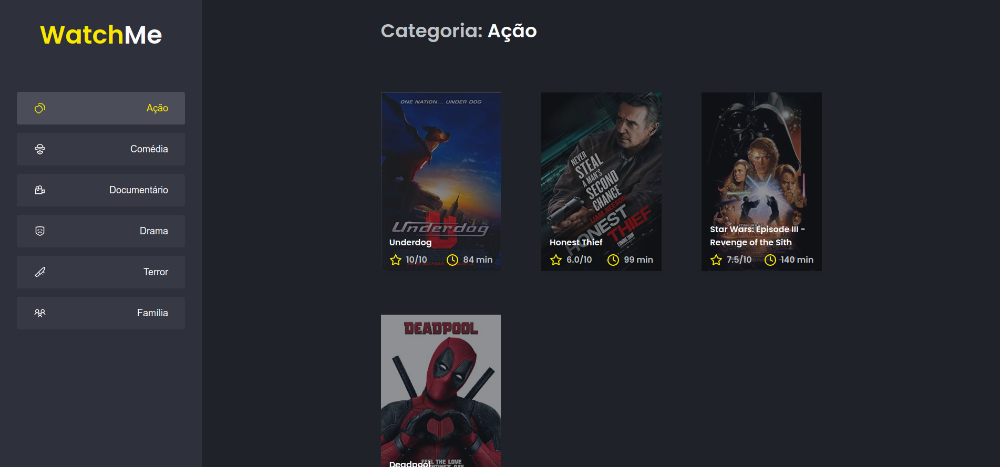
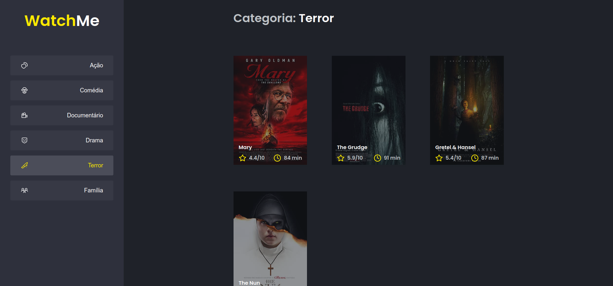

# Desafio 02 - Componentizando a aplicação

<p align="center"></p>

<br>

## :computer: Sobre o desafio

<hr>

Nesse desafio, você deverá criar uma aplicação para treinar o que aprendeu até agora no ReactJS.

Essa será uma aplicação onde o seu principal objetivo é refatorar uma página para listagem de filmes de acordo com gênero.

A aplicação já está totalmente funcional mas grande parte do seu código está diretamente no arquivo `App.tsx`. Para resolver isso da melhor forma, é necessário dividir a aplicação em **pelo menos** duas partes principais: sidebar e o conteúdo principal que possui o header e a listagem de filmes.

- A aplicação possui apenas uma funcionalidade principal que é a listagem de filmes;
- Na sidebar é possível selecionar qual categoria de filmes deve ser listada;
- A primeira categoria da lista (que é "Ação") já deve começar como marcada;
- O header da aplicação possui apenas o nome da categoria selecionada que deve mudar dinamicamente.

## Imagens

<div >
   
   
</div>

## :rocket: Techs

<ul>
  <li> HTML</li>
  <li> SCSS </li>
  <li> Javascript </li>
  <li> TypeScript </li>
  <li> ReactJS </li>
  <li> JSON Server </li>
  <li> Babel </li>
  <li> Webpack </li>
</ul>

## Desenvolvimento

---

### Pré-requisitos

- Instalar [Node.js](https://nodejs.org)

- Instalar [Yarn](https://yarnpkg.com/)

### Clone o repositório

```bash
$ git@github.com:vitorgaletti/ignite-reactjs-watch-me.git
```

### Executar Projeto

```bash
# Mudar para directório
$ cd ignite-reactjs-watch-me/
```

- Instalar dependências

```bash
$ yarn
```

- Execute

```bash
$ yarn server
```

```bash
$ yarn dev
```

- Executar scripts

|           Ação            |  Utilização   |
| :-----------------------: | :-----------: |
|    Iniciar o servidor     | `yarn server` |
| Iniciar o desenvolvimento |  `yarn dev`   |
|  Compilar para produção   | `yarn build`  |
